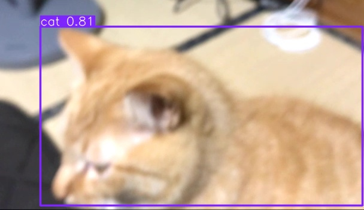

# 🐱 AI猫検知・防犯カメラシステム (Cat Security Camera)

Webカメラ（iPhone + Iriun Webcam）の映像をリアルタイムで解析し、猫を検知すると「警告音」を鳴らして「証拠写真」を自動保存するAIシステムです。
工場の「不良品検知システム」や「侵入検知」のロジックを家庭用に応用しました。

# 🎥 デモ

# ✨ 機能
*   リアルタイム物体検知: YOLOv8 (AI) を使用し、高速に「猫」だけを特定。
*   アラート機能: 検知と同時に警告音を再生。連打防止のクールダウン機能付き。
*   自動撮影: 検知した瞬間のフレームを画像として `captures/` フォルダに自動保存。
*   自動テスト: CI/CDを意識し、カメラがない環境でも静止画を使ってAIロジックを検証するテストコードを完備。

# 🛠 使用技術
*   言語: Python 3.13
*   AIモデル: Ultralytics YOLOv8
*   画像処理: OpenCV
*   音声処理: Pygame
*   テスト: Pytest

# 🚀 実行方法

# 準備
# ライブラリのインストール
pip install -r requirements.txt
# カメラ設定
PCにカメラが複数ある場合、以下のツールで番号を確認してください。
python check_cameras.py
確認した番号を cat_security.py の CAMERA_INDEX に設定します。
# 起動
python cat_security.py
